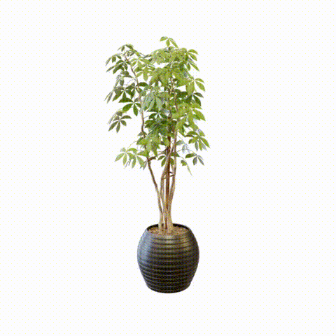
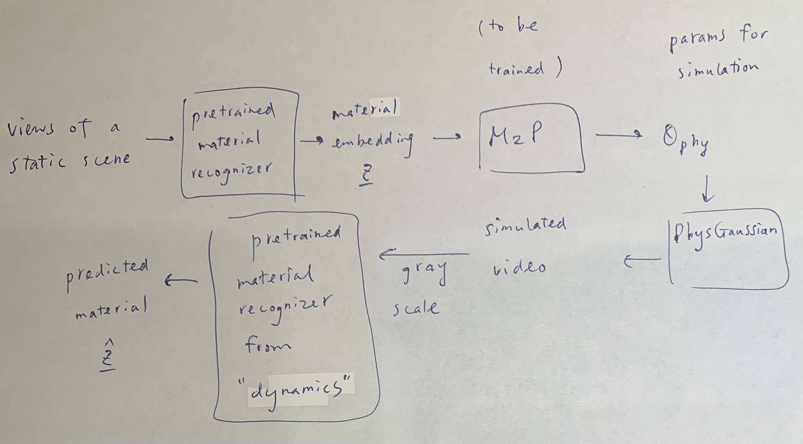

## Part 1

### 1. jelly

### 2. metal

## Part 2

### 1. jelly
n_grid changed from 50 to 55
PSNR: 38.16 dB

substep_dt changed from 1e-4 to 3e-05
PSNR: 37.97 dB

grid_v_damping_scale changed from 0.9999 to 0.999
PSNR: 38.08 dB

### 2. metal
n_grid changed from 120 to 60
PSNR: 40.19 dB

substep_dt changed from 1e-4 to 3e-05
PSNR: 43.03 dB

grid_v_damping_scale changed from 0.9999 to 0.9994
PSNR: 43.53 dB

### key takeaways, findings

A smaller value of grid_v_damping_scale makes the object stop oscillating more quickly. Besides, a larger value of n_grid contributes to higher simulation accuracy. In the jelly example, the tree sways 9 times in the simulation where n_grid=55, while it sways 8 times when n_grid=50. In addition, surprisingly, the value of substep_dt, the time step size, significantly affects the swing of the branches for the jelly material. Lastly, the softening parameter does not seem to affect the simulation of jelly and metal materials, for it only affects the plasticine material.

### BONUS

Train the model by minimizing the loss between the material embedding and the predicted material. It looks feasible to me, for the pretained models needed in my pipeline seem to be existing work.

### youtube video

https://youtu.be/MtN_EzKoZiE?si=cCWpVx3LFfEW6ij3

### How I adjusted the parameters
Add new or adjust existing parameters in config files. PSNR values are averaged accross all frames.

